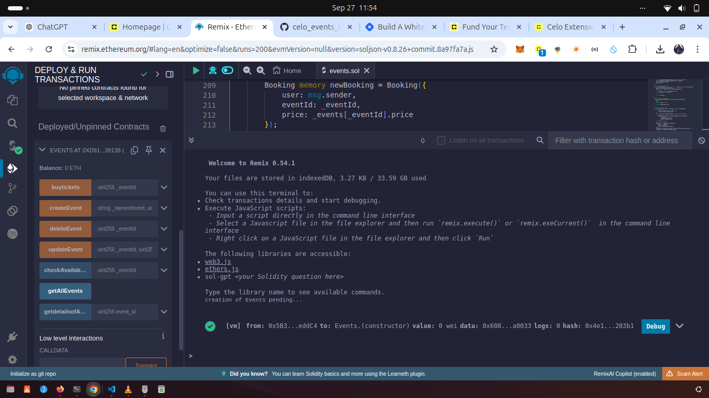

# EVENTS_SMART CONTARCT TUTORIAL

## Table of Contents
- [Introduction](#introduction)
- [What is Celo](#what-is-celo)
- [Prerequisites](#prerequisites)
- [Requirements](#requirements)
- [Developing our Smart Contract](#developing-our-smart-contract)
- [Testing And Deploying the Smart Contract](#testing-and-deploying-the-smart-contract)
- [Conclusion](#conclusion)

## Introduction
 In this tutorial, we will guide you through the process of building a smart contract on the Celo blockchain, specifically focusing on an event-driven smart contract. 
 Celo is designed with mobile-first principles, and it's built to provide a stable, fast, and scalable environment for decentralized applications (dApps).

 This tutorial assumes that you have a basic understanding of Ethereum and Solidity since Celo is EVM-compatible. This means you can use many Ethereum tools and 
 libraries to develop on Celo. However, Celo introduces several unique features that make it stand out, especially for mobile use.

## What is Celo

Celo is a blockchain platform designed specifically for mobile devices and focused on making cryptocurrency accessible to everyone. 
The following summary captures Celo's key strengths very well. Let me expand on each of these features to provide a deeper understanding of what makes Celo a unique and powerful blockchain platform:
1. ##### Mobile-First Design: 
   Celo’s main innovation is its emphasis on mobile devices. While many blockchain platforms are designed for desktop use, Celo’s infrastructure is optimized for mobile, 
   which is vital in regions where smartphones are the primary means of internet access. This allows users with limited technical expertise and access to traditional 
   banking services to send and receive payments with ease. Celo achieves this through features like lightweight mobile wallets that don’t require users to run a full 
   node, and by allowing users to send crypto using phone numbers instead of cryptographic addresses, making transactions more user-friendly.

2. ##### Stablecoins:
   Celo has built-in support for stablecoins, such as cUSD (Celo Dollar), which are pegged to the value of their respective fiat currencies. Stablecoins offer several 
   benefits:

    ▪ Stable Value: the volatility commonly associated with cryptocurrencies like Bitcoin or Ethereum, making them more practical for everyday transactions.

    ▪ User Adoption: Pegging to familiar fiat currencies encourages users to adopt and integrate stablecoins into their daily financial lives.

    ▪ Efficient Remittances: Users can send stablecoins across borders with minimal fees, addressing challenges in regions where remittances are crucial for income.

    ▪ Scalability and Speed: Celo’s Proof of Stake (PoS) consensus mechanism enables fast and scalable transactions. Unlike Proof of Work (PoW), PoS is much more 
      efficient in terms of both speed and resource usage. Celo’s network can handle a significant number of transactions per second (TPS) at lower fees, which is 
      essential for supporting a high volume of microtransactions often required in mobile payments. Additionally, Celo’s PoS allows participants to stake tokens and 
      earn rewards, fostering a decentralized and secure network.

3. ##### Eco-Friendly: 
   With growing concerns over the environmental impact of blockchain technology (particularly PoW blockchains like Bitcoin, which require large amounts of computational 
   power), Celo’s PoS approach is designed to be energy-efficient. This positions Celo as a greener alternative, aligning with the increasing demand for eco-friendly 
   technology.

4. ##### Decentralized Applications (dApps): 
   Celo enables developers to build decentralized applications (dApps) that leverage the platform’s mobile-first approach and stablecoin features. This opens up 
   possibilities for various use cases, including:

     ▪  Micro-lending platforms That provide users in underbanked regions access to credit.

     ▪ Remittance services
       That allow users to send funds internationally in a matter of seconds.

5. ##### DeFi
   Decentralized finance services that can cater to mobile users globally. Celo’s developer ecosystem supports Ethereum tools like Solidity and Truffle, making it easy 
   for Ethereum developers to transition to Celo.


Overall, Celo aims to create a more inclusive financial system by leveraging the accessibility of mobile technology and the benefits of blockchain.

## Prerequisites

- Basic Understanding of Blockchain Concepts: Familiarity with how blockchains operate and their key features.
  
- Understanding of Smart Contracts: Know what smart contracts are and how they function within a blockchain environment.
  
- Knowledge of Solidity: A foundational grasp of Solidity and its core concepts.
  

## Requirements

 - Stable Internet Connection: Since we will be coding online, a reliable internet connection is essential.
   
 - Celo Extension Wallet: Install the Celo Wallet extension for your browser to manage your Celo assets.
   
 - Familiarity with Remix IDE(https://remix.ethereum.org/): We will use Remix IDE for coding and testing our smart contract. Basic navigation skills will be helpful.

## Developing our Smart Contract

In this section, we will explore a Celo smart contract written in Solidity for events .

First, open your browser and go to **Remix IDE**. This online development environment will allow us to write, test, and deploy our smart contract.

Create a new file and name it events.sol and Copy and paste the following code into the file:
```solidity
    // SPDX-License-Identifier: GPL-3.0

     pragma solidity ^0.8.0;
```
**SPDX** stands for Software Package Data Exchange. It’s a standardized way to communicate the licensing of software.
**The GPL-3.0** refers to the GNU General Public License, version 3. This license allows users to freely use, modify, and distribute the software, provided that any distributed modifications are also open-source and under the same license.

**pragma solidity ^0.8.0** This line specifies the version of Solidity that the code is compatible with.
^0.8.0 means that the code is compatible with version 0.8.0 and any later version up to (but not including) 0.9.0. The caret (^) allows for automatic updates to newer minor versions while ensuring backwards compatibility.

```solidity
interface IERC20Token {
function transfer(address, uint256) external returns (bool);

    function approve(address, uint256) external returns (bool);

    function transferFrom(
        address,
        address,
        uint256
    ) external returns (bool);

    function totalSupply() external view returns (uint256);

    function balanceOf(address) external view returns (uint256);

    function allowance(address, address) external view returns (uint256);

    event Transfer(address indexed from, address indexed to, uint256 value);
    event Approval(
        address indexed owner,
        address indexed spender,
        uint256 value
    );

}
```
### Overview
The ERC-20 standard is a widely adopted standard for fungible tokens on the Ethereum blockchain. This interface outlines the essential methods and events that any ERC-20 token contract must implement.

### Functions
**transfer(address to, uint256 value) external returns (bool);**

Purpose: Transfers value amount of tokens from the caller's account to the to address.
Returns: A boolean indicating whether the transfer was successful.

**approve(address spender, uint256 value) external returns (bool);**

Purpose: Allows the spender to withdraw up to value amount of tokens from the caller's account.
Returns: A boolean indicating whether the approval was successful.

**transferFrom(address from, address to, uint256 value) external returns (bool);**

Purpose: Transfers value amount of tokens from the from address to the to address, using the allowance mechanism. This is typically used when a third party (the spender) is transferring tokens on behalf of the token owner.
Returns: A boolean indicating whether the transfer was successful.

**totalSupply() external view returns (uint256);**

Purpose: Returns the total supply of tokens in existence.
View: This function does not modify the state and can be called without sending a transaction.

**balanceOf(address account) external view returns (uint256);**

Purpose: Returns the token balance of the specified account.
View: Like totalSupply, this function is read-only.

**allowance(address owner, address spender) external view returns (uint256);**

Purpose: Returns the remaining number of tokens that the spender is allowed to spend on behalf of the owner.
View: This function also does not modify the state.

### Events
**event Transfer(address indexed from, address indexed to, uint256 value);**

Purpose: This event is emitted when tokens are transferred, whether through transfer or transferFrom. The indexed keyword allows for easier filtering of logs by from or to addresses.

**event Approval(address indexed owner, address indexed spender, uint256 value);**

Purpose: This event is emitted when the approve function is called, indicating that the spender has been approved to spend value tokens on behalf of the owner.
### Summary of IERC20
The IERC20Token interface defines the core functions and events necessary for any ERC-20 token implementation, ensuring standardization and interoperability within the Ethereum ecosystem. Implementing this interface allows other contracts and applications to interact with the token seamlessly.

```solidity
  contract Events {}
```
The line **contract Events {}** defines an empty Solidity contract named Events. Here’s a breakdown of the components:

**contract Keyword:**

This keyword is used to define a new contract in Solidity. A contract in Ethereum is similar to a class in object-oriented programming; it encapsulates data and functions.

**Events:**

This is the name of the contract. Naming conventions typically use PascalCase, and it's common to name contracts based on their functionality.

```solidity
   uint256 private eventscount = 0;
    // Mapping of events
    mapping(uint256 => Event) private _events;

    // Mapping of bookings
    mapping(address => Booking[]) private _bookings;

    // Event emitted when a new event is created
    event NewEventCreated(
        uint256 indexed eventId,
        string eventName,
        string description,
        uint256 startDate,
        uint256 endDate
    );

    //update event
    event updateevent(string eventName, uint256 startDate, uint256 endDate);

    //delete event
    event deleteevent(string eventname, uint256 eventid);

    // Event emitted when a booking is made
    event BookingMade(
        address indexed user,
        uint256 indexed eventId,
        string nameofevent
    );

    // Event emitted when a booking is canceled

    struct Event {
        string name;
        uint256 startDate;
        uint256 endDate;
        uint256 price;
        bool isActive;
        address owner;
        string description;
        uint256 event_id;
        uint256 total_tickets;
        bool isrefundable;
        address payable celoaddress;
    }

    struct Booking {
        address user;
        uint256 eventId;
        uint256 price;
    }
```

Let’s break down the code snippet provided above, which defines some components for an event management smart contract in Solidity.

## Components Explained

###  State Variables

**uint256 private eventscount = 0;**

**Type: uint256** this is an unsigned integer used to keep track of the total number of events that have been created. Starting at zero, this variable will be incremented each time a new event is added.

This is a powerful data structures for associating unique keys with values. Mappings are essentially hash tables, offering constant-time complexity for reading and writing operations. Each mapping is declared with a specific key type and a value type, and they are all marked as internal, meaning they can only be accessed within the contract or contracts deriving from it
A mapping that links a unique event ID (of type uint256) to an Event struct. It allows you to retrieve event details by their ID.
This mapping associates a unique event ID (of type uint256) with an Event struct. It allows you to look up events by their ID.
example
**mapping(address => Booking[]) private _bookings;**

This mapping tracks bookings made by users. It maps a user's Ethereum address to an array of Booking structs, allowing each user to have multiple bookings.

### Events
Events serves as notifications that occur when specific actions take place within the contract.
It helps external applications (like dApps) listen for and respond to new events being added to the system.
example
```solidity
  event BookingMade(
        address indexed user,
        uint256 indexed eventId,
        string nameofevent
    );
```

**event BookingMade(...)**

This event is emitted when a booking is made. It records the user's address, the event ID, and the name of the event.

###  Structs
This is a custom data type that allows you to group together variables of diffrent data types. Structs are particularly useful for organizing related pieces of data.

**struct Event**
This struct defines the data types of an event:

example
```solidity
   struct Event {
        string name;
        uint256 startDate;
        uint256 endDate;
        uint256 price;
        bool isActive;
        address owner;
        string description;
        uint256 event_id;
        uint256 total_tickets;
        bool isrefundable;
        address payable celoaddress;
    }
```
**Event**
This is the name of user defined data type

**uint256**

This a data type that stands for unsigned integer

**string**
This field  allow  text-based input.

**address payable celoaddress;**

The type of address payable owner  stores the address of the owner. The payable keyword allows this address to receive tokens. 

**bool**
It stands for true or false

### Functions

```solidity
    // Function to create a new event
    function createEvent(
        string memory _nameofevent,
        uint256 _startDate,
        uint256 _endDate,
        uint256 _price,
        string memory _description,
        uint256 _total_tickets,
        bool _isrefundable,
        address _celo
    ) external {
        require(
            _startDate > block.timestamp,
            "Start date must be in the future"
        );
        require(_endDate > _startDate, "End date must be after start date");
        require(_price > 1, "price must be not below zero");
        require(
            _total_tickets > 10,
            "number of tickets should be more than 10"
        );
        uint256 eventId = uint256(
            keccak256(abi.encodePacked(block.timestamp, _nameofevent))
        ) % 1000000;
        _events[eventId] = Event({
            name: _nameofevent,
            startDate: _startDate,
            endDate: _endDate,
            price: _price,
            isActive: true,
            owner: msg.sender,
            description: _description,
            event_id: eventId,
            total_tickets: _total_tickets,
            isrefundable: _isrefundable,
            celoaddress: payable(_celo)
        });
        eventscount++;
        emit NewEventCreated(
            eventId,
            _nameofevent,
            _description,
            _startDate,
            _endDate
        );
    }
```
This function is responsible for creating a new event. Here’s the detailed explanation:
**external:** This function can be called from outside the contract, meaning that other contracts or external accounts can invoke it.

**Parameters:** This function takes the following parameters _nameofevent, _startDate,_endDate,_price, _description,_total_tickets,isrefundable,_celo, _price:
Function Body
**Input Validations**
The function includes several require statements to validate the input parameters:
```solidity
require(
    _startDate > block.timestamp,
    "Start date must be in the future"
);
```
Ensures the event's start date is in the future.

The **require()** statement in Solidity is a way to enforce conditions or validations within a smart contract function. If the condition specified in a require statement evaluates to false, the transaction will be reverted, and any state changes made during the transaction will be undone.

** Event ID Generation**
```solidity
uint256 eventId = uint256(
    keccak256(abi.encodePacked(block.timestamp, _nameofevent))
) % 1000000;
```
Generates a unique event ID using a hash of the current block timestamp and the event name. The result is taken modulo 1,000,000 to keep the ID within a manageable range.

**Storing the Event**
```solidity
_events[eventId] = Event({
    name: _nameofevent,
    startDate: _startDate,
    endDate: _endDate,
    price: _price,
    isActive: true,
    owner: msg.sender,
    description: _description,
    event_id: eventId,
    total_tickets: _total_tickets,
    isrefundable: _isrefundable,
    celoaddress: payable(_celo)
});
```
Stores the new event in the _events mapping using the generated eventId. The event is initialized with all the provided parameters, including the owner’s address (msg.sender).

**Incrementing Event Count**
```solidity
eventscount++;
```
Increments the eventscount variable to keep track of the total number of events created.

**Emitting an Event**
```solidity
emit NewEventCreated(
    eventId,
    _nameofevent,
    _description,
    _startDate,
    _endDate
);
```
Emits the NewEventCreated event, signaling that a new event has been successfully created. This provides external applications with a way to react to the creation of new events.

```solidity
 function updateEvent(
        uint256 _eventId,
        uint256 _newStartDate,
        uint256 _newEndDate,
        uint256 _newPrices,
        bool _isrefundable,
        bool _isactive,
        string memory _description
    ) external {
        require(_events[_eventId].isActive, "Event is not active");
        require(
            _newStartDate > block.timestamp,
            "Start date must be in the future"
        );
        require(
            _newEndDate > _newStartDate,
            "End date must be after start date"
        );
        require(
            _events[_eventId].owner == msg.sender,
            "only owner is parmitted to this action"
        );
        _events[_eventId].startDate = _newStartDate;
        _events[_eventId].endDate = _newEndDate;
        _events[_eventId].description = _description;
        _events[_eventId].price = _newPrices;
        _events[_eventId].isActive = _isactive;
        _events[_eventId].isrefundable = _isrefundable;

        emit updateevent(_events[_eventId].name, _newStartDate, _newEndDate);
    }
```
The updateEvent function allows the owner of an event to update various details, such as the start and end dates, price, description, and refund policy. It includes robust input validation to ensure that only valid updates are made and that only the event owner can perform the update. By emitting an event after making changes, it provides transparency for users interacting with the smart contract.

```solidity
 // Function to delete an event
    function deleteEvent(uint256 _eventId) public {
        require(
            msg.sender == _events[_eventId].owner,
            "only owner is permitted to perform this action"
        );
        require(_events[_eventId].isActive, "Event is not active");
        emit deleteevent(_events[_eventId].name, _eventId);
        delete _events[_eventId];
        eventscount--;
    }
```
The deleteEvent function allows the owner of an event to delete it from the contract. It ensures that only the event owner can perform this action and that the event is currently active. By emitting an event before deletion, it provides a way to track the removal of events on the blockchain. Finally, it updates the count of total events to keep the state consistent.

```solidity
  //function to getallevents
    function getAllEvents() public view returns (Event[] memory) {
        uint256 eventCount = eventscount;
        Event[] memory allEvents = new Event[](eventCount);

        for (uint256 i = 0; i < eventCount; i++) {
            allEvents[i] = _events[i];
        }

        return allEvents;
    }
```
The getAllEvents function provides a way for users to retrieve all the events stored in the contract. It creates an array in memory, populates it with event data, and returns it. However, be aware that this implementation assumes events are indexed sequentially, which may not hold true if events have been deleted.

```solidity
 //search for a single event
    function getdetailsofAnEvent(uint256 event_id)
        public
        view
        returns (Event memory)
    {
        return _events[event_id];
    }
```
The getdetailsofAnEvent function provides a straightforward way to access the details of a specific event using its ID. It returns the entire Event struct, allowing the caller to see all the relevant information about that event.

```solidity
// Function to book tickets
    function buytickets(uint256 _eventId) external {
        require(
            _events[_eventId].total_tickets > 1,
            "events tickets already sold"
        );
        require(_events[_eventId].isActive, "Event is not active");
        require(
            IERC20Token(_events[_eventId].celoaddress).transferFrom(
                msg.sender,
                _events[_eventId].owner,
                _events[_eventId].price
            ),
            "Transfer failed."
        );
        Booking memory newBooking = Booking({
            user: msg.sender,
            eventId: _eventId,
            price: _events[_eventId].price
        });
        _events[_eventId].total_tickets = _events[_eventId].total_tickets - 1;
        _bookings[msg.sender].push(newBooking);

        emit BookingMade(msg.sender, _eventId, _events[_eventId].name);
    }

```
The buytickets function allows users to purchase tickets for a specific event, enforcing several checks to ensure the transaction's validity:

- It verifies that tickets are still available.
- It checks if the event is active.
- It handles the transfer of payment using ERC20 tokens.
- It records the booking and updates the ticket count.
- It emits an event to signal that a booking has been made.
This function encapsulates the logic needed for ticket purchasing while ensuring that the necessary validations are in place to protect the integrity of the ticketing system

```solidity
  // Function to check availability of tickets
    function checkAvailability(uint256 _eventId)
        external
        view
        returns (uint256 availableTickets)
    {
        require(_events[_eventId].isActive, "Event is not active");

        availableTickets = _events[_eventId].total_tickets;
    }
```
The checkAvailability function provides a way for users to query how many tickets are still available for a specific event. It ensures that only active events can be queried and returns the number of available tickets. This is useful for users wanting to know if they can purchase tickets for an event before attempting to do so.

here is the full code
```solidity
// SPDX-License-Identifier: MIT
pragma solidity ^0.8.0;

interface IERC20Token {
    function transfer(address, uint256) external returns (bool);

    function approve(address, uint256) external returns (bool);

    function transferFrom(
        address,
        address,
        uint256
    ) external returns (bool);

    function totalSupply() external view returns (uint256);

    function balanceOf(address) external view returns (uint256);

    function allowance(address, address) external view returns (uint256);

    event Transfer(address indexed from, address indexed to, uint256 value);
    event Approval(
        address indexed owner,
        address indexed spender,
        uint256 value
    );
}

contract Events {
    uint256 private eventscount = 0;
    // Mapping of events
    mapping(uint256 => Event) private _events;

    // Mapping of bookings
    mapping(address => Booking[]) private _bookings;

    // Event emitted when a new event is created
    event NewEventCreated(
        uint256 indexed eventId,
        string eventName,
        string description,
        uint256 startDate,
        uint256 endDate
    );

    //update event
    event updateevent(string eventName, uint256 startDate, uint256 endDate);

    //dlet event
    event deleteevent(string eventname, uint256 eventid);

    // Event emitted when a booking is made
    event BookingMade(
        address indexed user,
        uint256 indexed eventId,
        string nameofevent
    );

    // Event emitted when a booking is canceled

    struct Event {
        string name;
        uint256 startDate;
        uint256 endDate;
        uint256 price;
        bool isActive;
        address owner;
        string description;
        uint256 event_id;
        uint256 total_tickets;
        bool isrefundable;
        address payable celoaddress;
    }

    struct Booking {
        address user;
        uint256 eventId;
        uint256 price;
    }

    // Function to create a new event
    function createEvent(
        string memory _nameofevent,
        uint256 _startDate,
        uint256 _endDate,
        uint256 _price,
        string memory _description,
        uint256 _total_tickets,
        bool _isrefundable,
        address _celo
    ) external {
        require(
            _startDate > block.timestamp,
            "Start date must be in the future"
        );
        require(_endDate > _startDate, "End date must be after start date");
        require(_price > 1, "price must be not below zero");
        require(
            _total_tickets > 10,
            "number of tickets should be more than 10"
        );
        uint256 eventId = uint256(
            keccak256(abi.encodePacked(block.timestamp, _nameofevent))
        ) % 1000000;
        _events[eventId] = Event({
            name: _nameofevent,
            startDate: _startDate,
            endDate: _endDate,
            price: _price,
            isActive: true,
            owner: msg.sender,
            description: _description,
            event_id: eventId,
            total_tickets: _total_tickets,
            isrefundable: _isrefundable,
            celoaddress: payable(_celo)
        });
        eventscount++;
        emit NewEventCreated(
            eventId,
            _nameofevent,
            _description,
            _startDate,
            _endDate
        );
    }

    // Function to update an existing event
    function updateEvent(
        uint256 _eventId,
        uint256 _newStartDate,
        uint256 _newEndDate,
        uint256 _newPrices,
        bool _isrefundable,
        bool _isactive,
        string memory _description
    ) external {
        require(_events[_eventId].isActive, "Event is not active");
        require(
            _newStartDate > block.timestamp,
            "Start date must be in the future"
        );
        require(
            _newEndDate > _newStartDate,
            "End date must be after start date"
        );
        require(
            _events[_eventId].owner == msg.sender,
            "only owner is parmitted to this action"
        );
        _events[_eventId].startDate = _newStartDate;
        _events[_eventId].endDate = _newEndDate;
        _events[_eventId].description = _description;
        _events[_eventId].price = _newPrices;
        _events[_eventId].isActive = _isactive;
        _events[_eventId].isrefundable = _isrefundable;

        emit updateevent(_events[_eventId].name, _newStartDate, _newEndDate);
    }

    // Function to delete an event
    function deleteEvent(uint256 _eventId) public {
        require(
            msg.sender == _events[_eventId].owner,
            "only owner is permitted to perform this action"
        );
        require(_events[_eventId].isActive, "Event is not active");
        emit deleteevent(_events[_eventId].name, _eventId);
        delete _events[_eventId];
        eventscount--;
    }

    //function to getallevents
    function getAllEvents() public view returns (Event[] memory) {
        uint256 eventCount = eventscount;
        Event[] memory allEvents = new Event[](eventCount);

        for (uint256 i = 0; i < eventCount; i++) {
            allEvents[i] = _events[i];
        }

        return allEvents;
    }

    //search for a single event
    function getdetailsofAnEvent(uint256 event_id)
        public
        view
        returns (Event memory)
    {
        return _events[event_id];
    }

    // Function to book tickets
    function buytickets(uint256 _eventId) external {
        require(
            _events[_eventId].total_tickets > 1,
            "events tickets already sold"
        );
        require(_events[_eventId].isActive, "Event is not active");
        require(
            IERC20Token(_events[_eventId].celoaddress).transferFrom(
                msg.sender,
                _events[_eventId].owner,
                _events[_eventId].price
            ),
            "Transfer failed."
        );
        Booking memory newBooking = Booking({
            user: msg.sender,
            eventId: _eventId,
            price: _events[_eventId].price
        });
        _events[_eventId].total_tickets = _events[_eventId].total_tickets - 1;
        _bookings[msg.sender].push(newBooking);

        emit BookingMade(msg.sender, _eventId, _events[_eventId].name);
    }

    // Function to check availability of tickets
    function checkAvailability(uint256 _eventId)
        external
        view
        returns (uint256 availableTickets)
    {
        require(_events[_eventId].isActive, "Event is not active");

        availableTickets = _events[_eventId].total_tickets;
    }
}
```

## Testing And Deploying the Smart Contract

To test the smart contract vist [remix](https://docs.celo.org/developer/deploy/remix). Install celo extension wallet from chromestore for chrome users.
To create a contract go to remix ide and  create a new file for your Solidity smart contract in Remix like ours we will name it as 
*events.sol* and paste the code above.


Go to your celo wallet that is Alfajores Test Network and copy the address and paste it on [faucet](https://faucet.celo.org/alfajores) to claim free test tokens

### To Compile Contract:

Click on the "Solidity Compiler" tab in the sidebar and select the appropriate compiler version for your contract. Click "Compile" to compile your contract code.


Go to your celo wallet that is Alfajores Test Network and copy the address

After copying celo wallet address paste it to the space next to deploy button

if your smart have deployed successfully you will see this


### Conclusion
In this tutorial, we've explored the process of building a events smart contract on the Celo blockchain using Solidity. We’ve learned about various components of the contract, including:

**Structs**: Used to represent complex data types such as events and bookings, allowing us to encapsulate related information in a single unit.

**Mappings**: Employed for efficiently storing and retrieving data, such as event details and user bookings, by associating unique identifiers with specific values.

**Events**: Used for logging significant occurrences within the contract, providing transparency and enabling external applications to react to important changes (e.g., ticket bookings and event updates).

**Functions**: Implemented to handle various functionalities, including creating events, booking tickets, checking availability, and deleting events. Each function includes necessary validations to maintain the integrity of the contract.

By understanding these components and their interactions, you can effectively manage events and ticket sales on the Celo blockchain, leveraging its capabilities for decentralized applications. This foundation can be expanded upon to incorporate additional features or integrate with front-end interfaces for a complete user experience.
